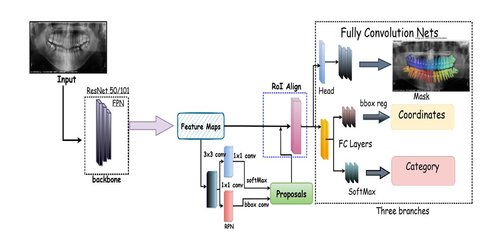
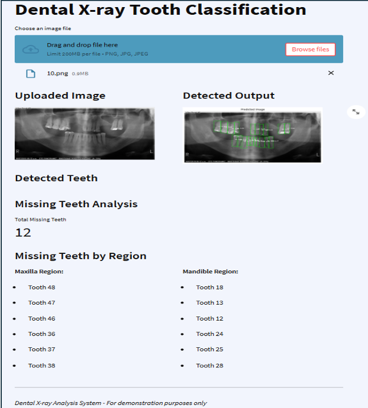
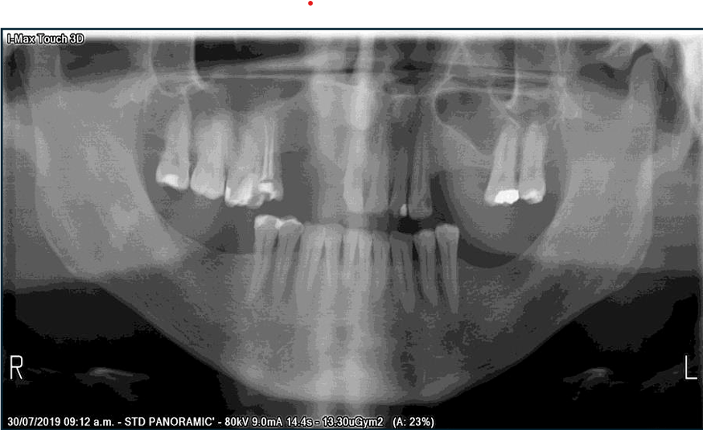
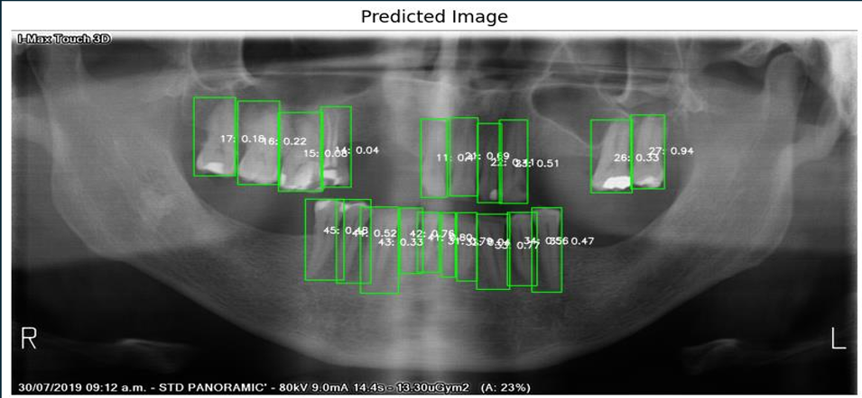

# 🦷 Enhanced Dental Classification and Numbering System using Deep Learning

> A deep learning-based system that automates tooth detection, segmentation, classification, and numbering from panoramic dental radiographs using Mask R-CNN.

---

## 📌 Overview

This project presents an AI-powered solution to streamline dental diagnostics by automatically detecting, segmenting, and numbering teeth from panoramic radiographs. Using **Mask R-CNN**, the system segments each tooth and assigns numbers based on the **FDI numbering system**, improving diagnostic precision and reducing manual effort.

---

## 🎯 Objectives

- Automatically detect and segment individual teeth in panoramic X-rays.
- Classify and assign accurate tooth numbers using the FDI system.
- Identify missing or impacted teeth for better diagnostic support.

---

## 🧪 Dataset

- **594 panoramic dental radiographs**
- Annotated manually using **VGG Image Annotator (VIA)**
- Resolution standardized to **1024×1024**
- Split: 80% Training / 20% Validation

**Source:** [Kaggle: Teeth Segmentation Dataset](https://www.kaggle.com/datasets/humansintheloop/teeth-segmentation-on-dental-x-ray-images)

---

## 🧠 Model Summary

### 🔹 Architecture
- **Model:** Mask R-CNN
- **Backbone:** ResNet-101
- **Segmentation:** Instance segmentation with RoI Align
- **Framework:** TensorFlow + Keras
---
## 🧭 Model Architecture

Below is the flowchart of the Mask R-CNN process used in this project for tooth detection, segmentation, and numbering:

## 💻 Application Interface

Here's a preview of the graphical interface used for tooth segmentation and numbering:

---

## 🖼️ Sample Outputs

| 🏷️ Input X-ray | 🧠 Prediction with Tooth Segmentation |
|----------------|----------------------------------------|
|  |  |

## 🔮 Future Scope

- **Extend the system to support 3D CBCT imaging and real-time segmentation.**

- **Integrate with Electronic Health Record (EHR) systems for automated dental charting.**

## 👥 Team Members

<table>
  <tr>
    <td align="center">
      <a href="https://github.com/AjithMoolya04">
         
        <b>Ajith Moolya</b>
      </a>
    </td>
    <td align="center">
      <a href="https://github.com/sujendranayak">
         
        <b>Sujendra Nayak</b>
      </a>
    </td>
    <td align="center">
      <a href="https://github.com/anushshetty">
         
        <b>Anush P Shetty</b>
      </a>
    </td>
    <td align="center">
      <a href="https://github.com/manjushetty">
         
        <b>Manjunath Shetty</b>
      </a>
    </td>
  </tr>
</table>

